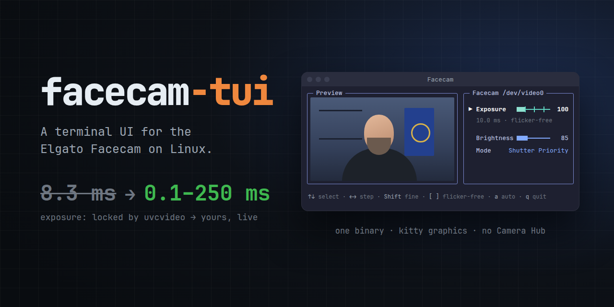

  

# facecam-tui

Terminal UI for the Elgato Facecam (USB `0fd9:0078`) on Linux: live preview, a realtime
exposure slider, brightness, and Auto / Shutter Priority.

The Linux `uvcvideo` driver keeps the Facecam's exposure time locked, because it only allows
that control in "Manual" mode and the Facecam has no Manual mode. This tool writes the exposure
time straight to the camera with a UVC request over usbfs, which works while the camera streams.

## Install and run

Build requirements: Rust stable, and libclang, because the `v4l` crate generates its bindings
with bindgen (`apt install libclang-dev`, or any installed LLVM that ships `libclang.so`).

    cargo install --locked --path .
    facecam-tui

Run it in a terminal emulator. kitty shows the preview as a real image; other terminals get
half-block characters. The preview needs the camera stream, which only one app can hold: while
Meet (or any other app) uses the camera, the preview pane says so, and the controls still work —
you see the change in the other app.

## Setup

`/dev/video*` needs the `video` group. The rest is in one udev file,
[`contrib/70-facecam.rules`](contrib/70-facecam.rules), which needs `v4l2-ctl` (package
`v4l-utils`):

    sudo install -m 644 contrib/70-facecam.rules /etc/udev/rules.d/
    sudo udevadm control --reload

Then unplug and plug in the camera. The file does three things:

- **Write access to the USB node** for the user at the local seat (`uaccess`). Exposure goes
  through `/dev/bus/usb/...`. Without access, exposure is disabled, and brightness and mode
  still work.
- **USB power saving off.** Linux suspends an idle camera after 2 s. After it wakes up, the
  Facecam rejects every control request for about half a second, and the app shows
  `Broken pipe (os error 32)`. Measured: 18 of 18 requests failed with power saving on, 0 of 18
  with it off.
- **50 Hz mains.** The camera can start set to 60 Hz, and Auto exposure then flickers under
  50 Hz lights. Use `power_line_frequency=2` in 60 Hz countries.

## Desktop launcher

To start it from the application menu (or Ulauncher, Rofi, and similar) with no terminal open:

    install -Dm755 contrib/facecam-tui-launch ~/.local/bin/facecam-tui-launch
    install -Dm644 contrib/facecam-tui.desktop ~/.local/share/applications/facecam-tui.desktop

It opens a kitty window named "Facecam". On `q` the window closes; on an error it stays open so
you can read the message. Set `FACECAM_TUI` if the binary is not in `~/.cargo/bin`. The menu
entry finds the launcher through `PATH`: if `~/.local/bin` is not in your desktop session's
`PATH`, put the full path in the entry's `Exec=` line.

## Keys

| Key | Action |
| --- | --- |
| `↓` `↑` or `Tab` / `Shift+Tab` | next / previous control (Exposure → Brightness → Mode) |
| `←` `→` | Exposure: previous / next flicker-free value (as `[` `]`) · Brightness: −10 / +10 · Mode: toggle |
| `Shift+←` `Shift+→` | Exposure: −10 / +10 · Brightness: −1 / +1 · Mode: toggle |
| `PgDn` `PgUp` | −100 / +100 |
| `[` `]` | Exposure only: previous / next multiple of 100 — flicker-free under 50 Hz light (below 100, `[` goes up to 100) |
| `a` | toggle Auto / Shutter Priority |
| `Enter` or `:` | type a value; `Enter` applies, `Esc` cancels |
| `r` | drop pending changes and read everything from the camera |
| `q` / `Esc` / `Ctrl+C` | quit |

Exposure is in units of 100 µs: 200 = 20 ms. Changing it switches the camera to Shutter Priority.
Above 166, apps that capture at 60 fps drop frames; above 333, 30 fps drops too. Under 50 Hz light
only multiples of 100 are flicker-free; the panel says so for any other value.

## Window

In kitty on X11 the window is fitted at start to the preview (the 960x540 image at its native
size) and the panel, and given its size back on quit if you have not resized it yourself. It needs
`xdotool` and `xprop`; a maximized or fullscreen window, tmux, and other terminals are left alone.
With the kitty graphics protocol the preview hugs the image and scales it to the pane; the
half-block fallback keeps its smaller, capped size.

## Development

After you clone, enable the pre-push gate:

    git config extensions.worktreeConfig true
    git config --worktree core.hooksPath .githooks

`bin/ci` runs `cargo fmt --check`, `cargo clippy -D warnings` and `cargo test`.
